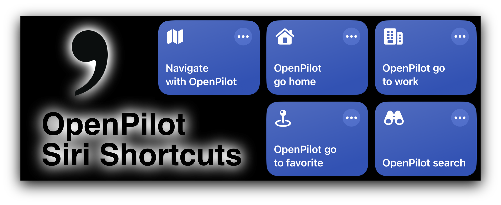
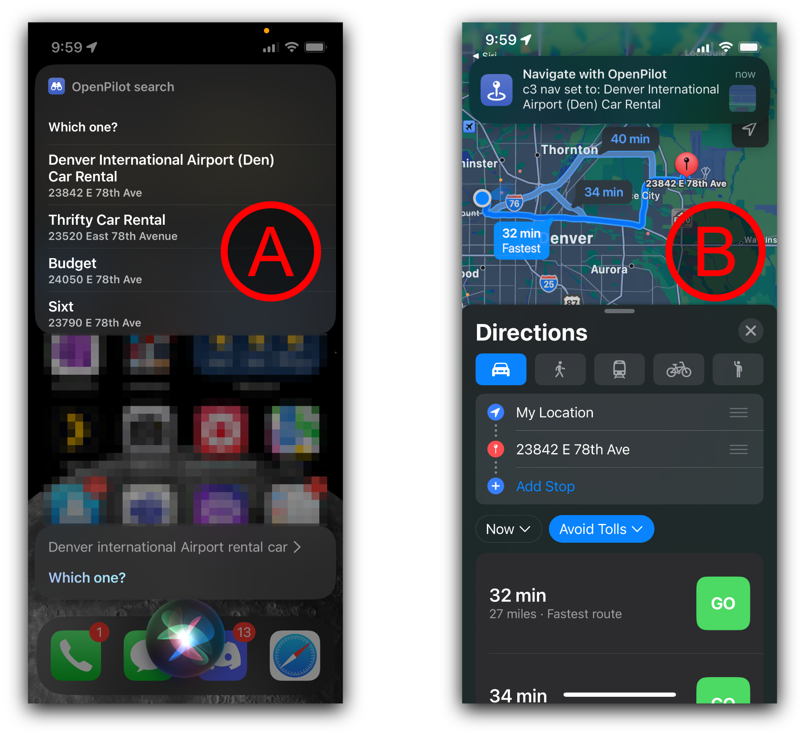

# [OpenPilot](https://www.comma.ai)🔗 [Siri Shortcuts](https://support.apple.com/en-gb/guide/shortcuts/welcome/ios)🔗

A set of iOS (and macOS) Shortcuts that let you quickly set the [OpenPilot navigation](https://blog.comma.ai/094release/#navigate-on-openpilot)🔗 destination from your iPhone, hands-free or not.  The Comma Connect API can be used to easily set the navigation destination on your Comma device. Here are Siri Shortcuts that provide the following functions for iPhone, iPad, and Mac users.

1. **Navigate with OpenPilot: Set OpenPilot navigation destination from a specified location/pin in Apple Maps, Google Maps, or Waze** using the [share sheet](https://www.idownloadblog.com/2020/04/21/customize-share-sheet-iphone-ipad/)🔗
2. **OpenPilot Search: Search for and select destinations**
   * by saying "*(Hey) Siri, OpenPilot search*" or
   * by tapping the shortcut/widget/home screen icon followed by your destination (after the prompt)
3. **Go to work — Go home**
   * by saying "*(Hey) Siri, OpenPilot go to work*" or
   * by saying "*(Hey) Siri, OpenPilot go home*", or
   * by tapping the shortcut/widget/home screen icon
4. **Go to favorite**
   * by saying "*(Hey) Siri, OpenPilot go to favorite*", then selecting a favorite from the list by voice or by tapping

## Installation

1. Acquire a [JWT authentication](https://api.comma.ai/#authentication)🔗 token at [jwt.comma.ai](https://jwt.comma.ai)🔗, where you'll login using the same method you use at Comma Connect
2. Go to [Comma Connect](https://connect.comma.ai)🔗 or [UserAdmin](https://useradmin.comma.ai)🔗 to get your Comma device dongle id (16 hex characters)
3. Download and install the OpenPilot Siri Shortcuts by tapping the following links on your iPhone, iPad, or Mac
   * Complete the setup process for each shortcut (except *search* which has none). The data you'll provide is described after each install link
   * On first run, you'll be prompted to give permission for the shortcuts to do things
   1. [Navigate on OpenPilot](https://www.icloud.com/shortcuts/b04fff94ddbb4821b73e856df6ac0f2e)🔗 `JWT token` `dongle id` `set multi-device behavior` `set default map app`
   2. [OpenPilot search](https://www.icloud.com/shortcuts/5a40906f54854190aaa1d710058096c9)🔗
   3. [OpenPilot go home](https://www.icloud.com/shortcuts/707d822051884754b80859da8da4b0dc)🔗 `set home address`
   4. [OpenPilot go to work](https://www.icloud.com/shortcuts/547d4297c8c54fcab03a47bf3d91386a)🔗 `set work address`
   5. [OpenPilot go to favorite](https://www.icloud.com/shortcuts/f6dd012dbb31405fbf5815f3891d5bbd)🔗 `set one or more favorite places`
4. Run shortcuts ii though v immediately to acquire permissions and enable hands-free use
* **If Siri will not recognize the word "OpenPilot" when you speak, you can "teach" it the word by [adding a new contact called OpenPilot, and by specifying a phonetic name for it](https://www.tapsmart.com/tips-and-tricks/youre-saying-wrong-teach-siri-new-words-pronunciations/)**

## Navigate with OpenPilot

* This is the main shortcut that actually performs [the API call](https://api.comma.ai/#set-destination)🔗. This shortcut works in two ways, via the ["Share Sheet"](https://www.idownloadblog.com/2020/04/21/customize-share-sheet-iphone-ipad/)🔗 and by being called by other shortcuts, providing a valid location as input.
* To use with **Apple Maps** (see images):
  1. Tap the share button for a selected location/pin in Apple Maps
  2. Select "Navigate with OpenPilot" from the list of share actions
     1. If you don't see it in the list, or want it to appear higher for easier access, scroll down and select "edit actions"
     2. Tap the plus sign next to "Navigate with OpenPilot"
     3. Arrange the favorite actions to your liking
  3. That's it! You should see a notification indicating that navigation has been set on your Comma device, and directions will open automatically in Apple Maps
* **Google Maps**: The process is identical, and directions will open in Google Maps
* **Waze**: The process is similar
  1. Select a location, tap "Send", then "more options" to open the share sheet, then select "Navigate with OpenPilot"
  2. Finish starting directions in Waze
* This shortcut takes *text* (for Waze), *URLs* (for Google Maps), and *MapLinks* (for Apple Maps) as input from the share sheet.
  * You can also run it from other shortcuts, such as in the other shortcuts provided here. This makes it very easy to extend the functionality.
  * *If you do anything cool, be sure to let me know so it can be added here!*

## OpenPilot search

* Voice search for locations, places or addresses, and choose from a visual + voice menu of results. Pick one and OpenPilot + iPhone navigation will start

1. Four ways to use:
   1. Say "(Hey) Siri, OpenPilot search" , or
      * (becuase "OpenPilot search" is the name of the Shortcut, and every shortcut is callable by name automatically)
   2. [Save the shortcut to a home/lock screen widget](https://support.apple.com/guide/shortcuts/run-shortcuts-from-the-home-screen-widget-apd029b36d05/ios)🔗, or
   3. [Save the shortcut as a home screen icon](https://support.apple.com/guide/shortcuts/add-a-shortcut-to-the-home-screen-apd735880972/ios#:~:text=In%20the%20Shortcuts%20app%20on,Tap%20Add%20to%20Home%20Screen.)🔗, or
   4. Tap the Shortcut in the Shortcuts app.
2. Wait for the prompt "what text?"
   * ("what text?" was not my idea; you can't change the prompt; smh)
3. Say the (mostly) complete address or location name without any long pauses
4. You'll be presented with a list of results, and Siri will begin to read them. You can respond verbally or tap one of the results (even with CarPlay 🚗). Select one of the results or tap/say cancel to cancel.
5. The default map app you specified during setup will open with directions to the destination, and you'll see a notification that navigation was set on your Comma device.

## Go home

* This simple shortcut lets you save one address
* When run, it passes this location to the *Navigate with OpenPilot* Shortcut

## Go to work

* Same Shortcut (as "Go home"), Different Destination
* You see how these could be replicated to add more

## Go to favorite

* Similar to home/work, but this one lets you specify multiple place names and locations
* When run, you can select one of the favorites from the list, verbally or by tapping (even in CarPlay 🚗)
* There is no set format to use for the specified locations
* The specified locations are used to search, and the top result is used. They need to be complete enough that the desired place will be the top result
